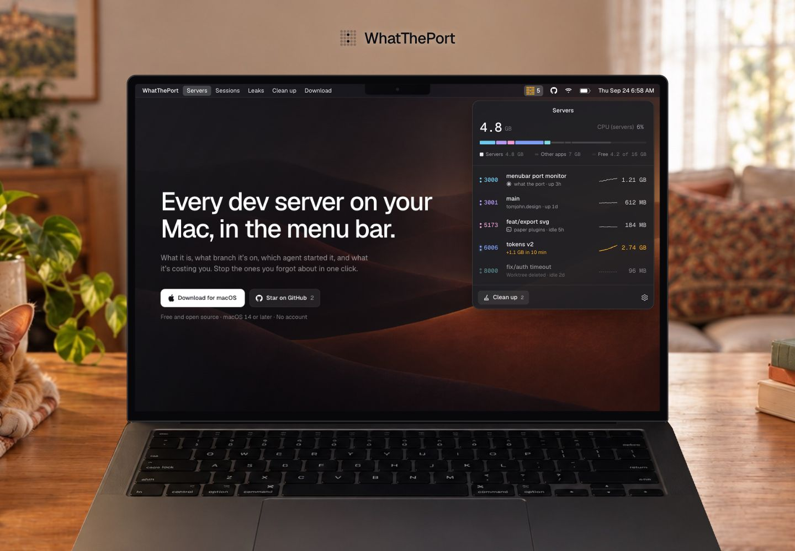
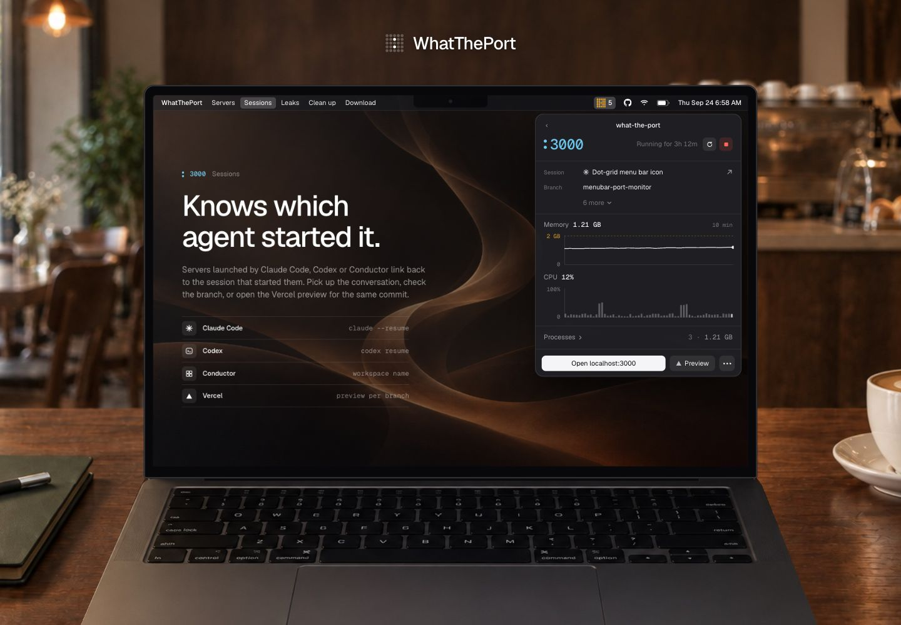
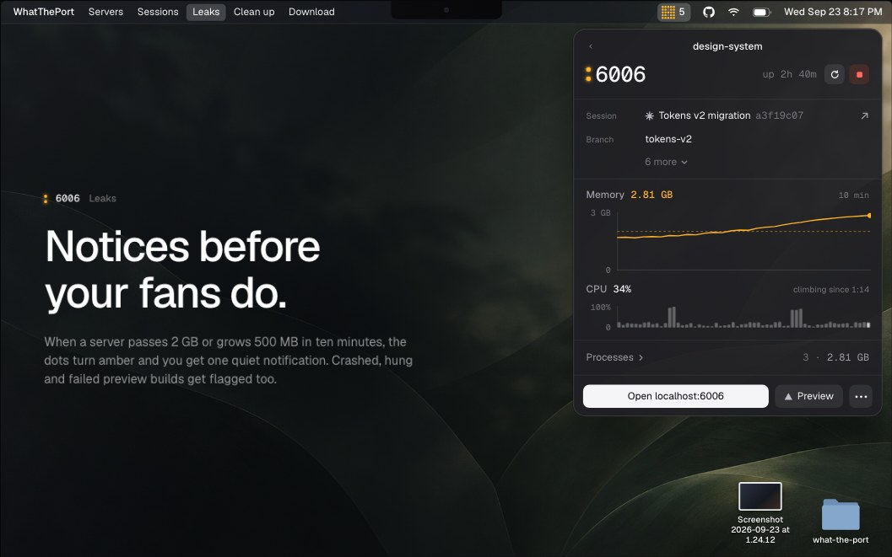
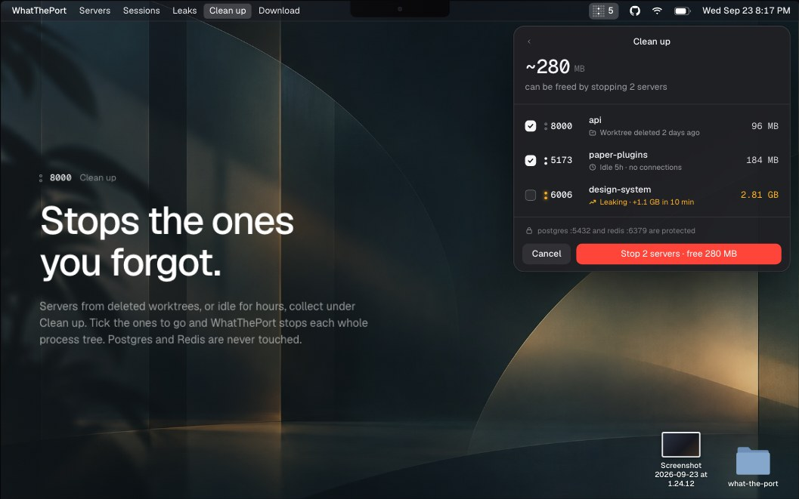

# WhatThePort

**Every dev server on your Mac, in the menu bar.**

What it is, what branch it’s on, which agent started it, and what it’s costing you. Stop the ones you forgot about in one click.

[**Download for macOS**](https://whattheport.dev/WhatThePort.dmg) · [Try the interactive demo](https://whattheport.dev) · [Build from source](#building)

Free and open source · macOS 14 or later · No account

[](https://whattheport.dev)

## Know what’s running

WhatThePort is a native Swift app that lives in your menu bar, with no Dock icon. Press **⌥⌘P** to see your local development servers: project names, ports, git branches, uptime, and resource use. Open a server in your browser, inspect its processes, or stop and restart it without hunting through terminals.

### Knows which agent started it

Servers launched by Claude Code, Codex, or Conductor link back to the session that started them. Pick up the conversation, check the branch, or open a Vercel preview. Optional pull request links use the GitHub CLI you’re already signed in to.



### Notices before your fans do

When a server passes the default 2 GB memory threshold or grows more than 500 MB in ten minutes, WhatThePort turns its menu bar amber and sends a notification. Port colors stay consistent, while amber memory readings flag servers needing attention. Ten minutes of memory and CPU history show what’s happening across the whole process tree. Adjust thresholds and snooze alerts in Settings.



### Stops the ones you forgot

**Clean up** adds checkboxes to the server list and preselects servers from deleted worktrees or idle for hours. Tick the ones to go and WhatThePort stops each whole process tree. Database processes such as Postgres and Redis are protected by default.

Choose **Off**, **Ask**, or **Automatic** cleanup in Settings. Leaking servers are never stopped automatically.



*Screenshots from the [marketing site’s interactive demo](https://whattheport.dev), using sample server data.*

## Get started

1. [Download WhatThePort](https://whattheport.dev/WhatThePort.dmg) and open it.
2. Drag **WhatThePort** onto the **Applications** shortcut beside it, then open it from Applications.
3. Start a development server, then click the dot grid in your menu bar or press **⌥⌘P**.

The prebuilt download is for **Apple Silicon Macs running macOS 14 or later**. To compile the app yourself, you’ll also need **Swift 5.9+**.

## Features

- **Every dev server at a glance** - Port, project, git branch, uptime and memory for each server, with stable port colors and a whole-Mac memory bar for servers, other apps, and free RAM
- **Knows what started it** - Links servers to the Claude Code, Codex or Conductor session that launched them
- **Resource charts** - 10 minutes of memory and CPU history per server, summed across its whole process tree
- **Leak detection** - Servers over 2 GB, or growing fast, turn amber in the list and the menu bar
- **Clean up** - Find servers from deleted worktrees or that have gone idle, and stop them in bulk
- **Stop and restart** - Stops the whole process tree; restart reruns the original command in the same folder
- **Alerts** - Notifications with Details, Stop and Snooze when a server passes your memory threshold or starts leaking
- **Automatic clean up (optional)** - Off, Ask or Automatic; leaking servers are never stopped automatically
- **Previews and pull requests (optional)** - A Vercel preview button and the branch's pull request, via the GitHub CLI you're already signed in to
- **Automatic updates** - Signed updates download in the background and install when you quit; controls and manual checks in Settings → About
- **Global shortcut** - ⌥⌘P opens the popover
- **Light and dark mode** - Follows your Mac’s appearance, with matching port numbers and colon colors

## Usage

WhatThePort lives in the menu bar as a small dot grid. Click it to see every server:

- Hover a row to open it in the browser or stop it
- Click a row for details: session, branch, folder, command, charts and processes
- Click **Clean up** to tick the servers you want gone and stop them together

Right-click the dot grid to open a server in the browser, open Settings, check for updates, send feedback or quit.

Can't see the dot grid? The menu bar hides icons that don't fit: click » at its edge on macOS 27, or check **System Settings → Menu Bar**. Opening WhatThePort again from Finder or Spotlight shows the popover, or Settings when the icon is hidden.

To check the UI without the menu bar, `WhatThePort --snapshot <dir>` renders each view with live data to PNG.
Add `--appearance light` or `--appearance dark` to check a specific appearance without changing your Mac’s settings.

To render the onboarding loading, success, missing-tool, and approval states without changing macOS permissions or login items, run `WhatThePort --snapshot-onboarding <dir>`.

### Settings

Open Settings from the gear in the popover (⌘,):

- **General** - Launch at login, menu bar icon style, editor, global shortcut, scan interval, anonymous usage sharing
- **Alerts** - Memory threshold, leak warnings, snooze length, start/stop notifications
- **Clean up** - Off / Ask / Automatic, what counts as idle or stale, protected processes, force-quit delay
- **Ports & processes** - Port range and which processes count as dev servers
- **Integrations** - Claude Code, Codex and Conductor session links, branch names, Vercel previews and pull requests
- **About** - Version, update controls, bug reports or feature requests as GitHub issues with your app and macOS versions filled in, and a tip jar

## How It Works

WhatThePort reads listening TCP sockets with `lsof`, then inspects each server's process tree directly through `libproc` and `sysctl`: memory footprint, CPU time, working directory, arguments and environment. From the working directory it finds the project manifest, framework and git branch. Session links come from environment variables that Claude Code and Conductor pass to the commands they run, and from Codex's session files. It rescans every 2 seconds.

## Privacy

There's no account and no analytics SDK. Everything the app shows comes from your Mac and stays there. It only goes online to:

- **Check for updates** - Sparkle fetches the update feed from whattheport.dev about once a day.
- **Share anonymous usage** - Once a day, the app requests `whattheport.dev/usage/<feature>` for each feature you used, such as `/usage/stop` or `/usage/clean-up`, plus `/usage/active` to say it ran. That's the whole report: no body, cookies or identifier, and nothing about your servers, projects, files or Mac. The app's user agent is just `WhatThePort/<version>`. The site only counts these requests. Like any web request, the host (Vercel) sees the connection's IP address in its standard logs; the counts don't use it. Onboarding asks before anything is sent, and you can turn it off in **Settings → General → Privacy**. See [`Usage.swift`](WhatThePort/Sources/WhatThePort/Engine/Usage.swift) for the full list.
- **Look up previews and pull requests (off by default)** - Uses the GitHub CLI you're already signed in to.

The website uses cookieless [Vercel Web Analytics](https://vercel.com/docs/analytics) to count visits and download clicks.

## Building

```bash
cd WhatThePort
swift build
```

To build the app bundle:

```bash
./build-app.sh
open .build/WhatThePort.app
```

For updater-enabled releases, see [Automatic updates and release setup](WhatThePort/UPDATES.md). The release script packages the app as a notarized disk image and generates a signed update feed for the website.

To package a local build as the download's disk image, run `./make-dmg.sh` after `./build-app.sh`.

## Automatic deployment

Every push to `main`, including a merged pull request, runs
[Rebuild and deploy site and app](.github/workflows/deploy.yml). It builds the
Apple Silicon Mac app on macOS, verifies its ad-hoc signature, and packages it as
`WhatThePort.dmg` ([`make-dmg.sh`](WhatThePort/make-dmg.sh)): the app beside an
Applications shortcut, on a background designed in Paper
([`WhatThePort/dmg/`](WhatThePort/dmg)). A Linux job then puts that artifact at `public/WhatThePort.dmg`,
builds the Next.js site, and deploys both together to production on Vercel. A
failed app or site build stops deployment.

The download is never checked in, so the site always serves the latest release.
Production builds fail unless `public/WhatThePort.dmg` is a disk image and any
update feed is for this commit's build ([`scripts/check-download.mjs`](scripts/check-download.mjs)). Local dev
and preview deployments don't have the file, so they redirect downloads to
production.

Configure these GitHub Actions **repository secrets** under
**Settings → Secrets and variables → Actions** before merging this workflow:

- `VERCEL_TOKEN`: a Vercel access token with access to the production project.
- `VERCEL_ORG_ID`: the production project's `orgId` from `.vercel/project.json`.
- `VERCEL_PROJECT_ID`: its `projectId` from `.vercel/project.json`.

Run `vercel link` locally to obtain the project IDs. Keep tokens and the generated
`.vercel` directory out of Git.

The app's tip jar opens `whattheport.dev/tip`, which redirects to the `TIP_URL`
environment variable, so the payment page can change without an app update. Create
a Stripe [Payment Link](https://dashboard.stripe.com/payment-links) and set its
type to **Customers choose what to pay** (not a product price), then add it to the Vercel project's production
environment with `vercel env add TIP_URL production`. Production builds fail
without it ([`scripts/check-tip.mjs`](scripts/check-tip.mjs)); local dev and
previews redirect `/tip` to production.

`vercel.json` disables Vercel's automatic Git deployments for `main`, so only this
workflow publishes production with the freshly built app. Other branches retain
Vercel's normal preview deployments. To retry production,
use **Actions → Rebuild and deploy site and app → Run workflow** with `main`
selected. Production runs are serialized; GitHub may replace a pending run with
a newer one when several merges arrive during an active deployment.

Until its signing secrets are configured, the workflow uses ad-hoc signing and
builds without an update feed. Once they are, it signs with Developer ID,
notarizes the app, and publishes a signed Sparkle feed under `/updates/`. See
[Release from GitHub Actions](WhatThePort/UPDATES.md#release-from-github-actions).

## About

Made by [Tomjohn](https://tomjohn.design). Explore the [interactive demo](https://whattheport.dev) or browse the source to see how it works. If WhatThePort saves you time, [buy me a coffee](https://whattheport.dev/tip).

## License

MIT
